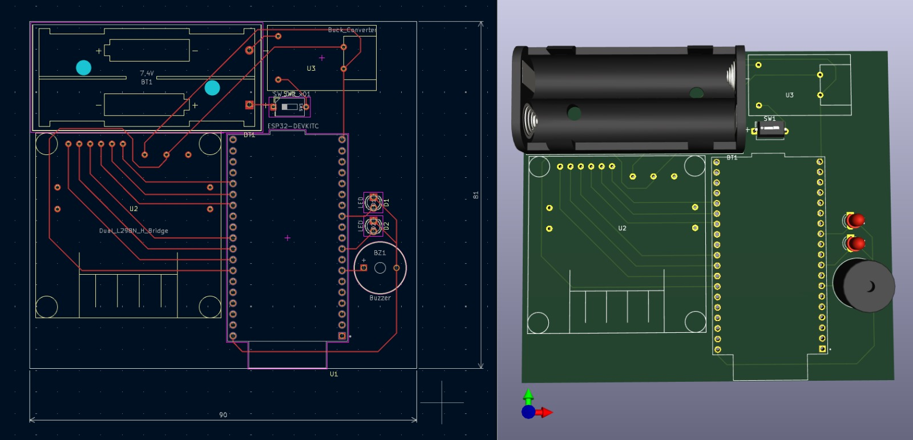

## Layout PCB
---
## Visualização

---
## Descrição

O layout apresentado acima representa o design da placa de circuito impresso (PCB) do Robô Mini Sumô.
A placa foi projetada para abrigar os principais componentes do sistema, incluindo o microcontrolador ESP32, o módulo de ponte H (L9110s), o regulador de tensão Buck, buzzer, LEDs indicadores e o suporte das baterias Li-Ion.

Embora o layout mostre dimensões aproximadas de 8,1 x 9 cm, a placa será confeccionada de forma manual, utilizando uma placa perfurada de fenolite de 7 x 9 cm.
A montagem será feita com solda, fios e barramentos, seguindo a disposição ilustrada no layout.
---

## Arquivos do Projeto

Mesmo sendo uma fabricação caseira, todos os arquivos da PCB estão disponíveis nesta pasta para referência e possível reprodução futura, incluindo:

- Arquivos Gerber (para fabricação profissional, se desejado)
- Arquivo SVG (para visualização vetorial do layout)
- Arquivos de projeto do KiCad (.kicad_pcb, .sch, etc.)
- Imagens e visualizações da placa

Esses arquivos garantem a rastreabilidade do projeto e permitem que a placa possa ser refeita ou aprimorada posteriormente.

